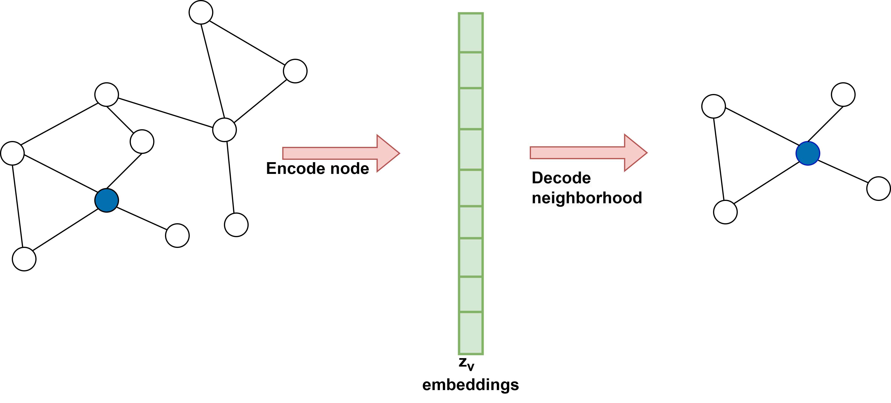

## Introduction

In graph-based deep learning, low-dimensional vector representations of nodes in a graph are known as node embeddings. The goal of node embeddings is to project graph nodes from their original feature space into a lower-dimensional space to reduce computational complexity while retaining the structural and relational information of nodes in the graph. A key idea in graph-based deep learning, or more precisely in graph representation learning, is to learn these node embeddings.

### Encoder-decoder framework

In graph representation learning, we leverage the encoder-decoder framework to facilitate a comprehensive understanding of the graph structure. It is achieved in two crucial steps. Firstly, an encoder model is employed to map each node in the graph to a compact, low-dimensional vector, known as embedding. These embeddings are then passed as input to a decoder model that aims to reconstruct the local neighborhood information for each node in the original graph. By doing so, we obtain a rich and structured graph representation conducive to further analysis. The encoder-decoder framework is depicted in Figure 1.

- **Encoder:**

  The encoder can be interpreted as a mapping function that transforms node $v \in V$ in the graph into a vector representation $Z_v \in \mathbb{R} ^d$ where $Z_v$ represents the embedding for node $v \in V$. The encoder takes node IDs as input and generates node embeddings corresponding to the node. Hence,

\[
\text{ENC: } V \to \mathbb{R}^d
\]

  The encoder typically utilizes a shallow embedding approach, performing an embedding lookup based on the node ID. Shallow embedding approaches are where an encoder that maps each node to a unique embedding is just a simple lookup function without considering any node features. This can be stated as:

  %20%3D%20Z%5Bv%5D)

  where matrix \( Z \in \mathbb{R} ^{\left| V \right| \times d} \) contains \( d \)-dimensional embedding vectors for all nodes in the graph and \( Z[v] \) is a row in matrix \( Z \) corresponding to node \( v \).

- **Decoder:**

  The decoder takes as input the node embeddings generated by the encoder and tries to recover graph statistics from these node embeddings. The ultimate goal of the decoder is to minimize the difference between its output \( DEC(z_u, z_v) \) and the graph-based similarity measure \( S[u,v] \). A common example of a node similarity-based matrix, \( S[u,v] \), is the adjacency matrix, \( A[u,v] \), of the graph.

  For the optimization process to achieve this goal, a loss function \( L \) is defined as:

  %20%5Cin%20D%7D%20l(DEC(z_u%2C%20z_v)%2C%20S%5Bu%2Cv%5D))

  where \( l: \mathbb{R} \times \mathbb{R} \to \mathbb{R} \) quantifies the difference between the estimated similarity value \( DEC(z_u, z_v) \) and true similarity values \( S[u,v] \). The loss function \( l \) might be a mean-squared error or cross-entropy, depending on the decoder and similarity function \( S \). The objective is to refine the decoder to accurately reconstruct pairwise node relationships in the training set \( D \), typically using stochastic gradient descent or other suitable optimization techniques.

  The table below presents a few shallow encoding-based Encoder-Decoder approaches:

  | Method            | Decoder                      | Loss function                                    |
  |-------------------|------------------------------|--------------------------------------------------|
  | Laplacian Eigenmaps | \(||z_u - z_v||_2^2\)       | \(DEC(z_u, z_v) . S[u,v]\)                       |
  | Graph Factorization | \(z_u^T z_v\)               | \(||DEC(z_u, z_v) - S[u,v]||_2^2\)              |
  | GraRep            | \(z_u^T z_v\)                | \(||DEC(z_u, z_v) - S[u,v]||_2^2\)              |
  | DeepWalk          | \(e^{z_u^T.z_v} / \sum_{k\in V} e^{z_u^T.z_k}\) | \(-S[u,v]. \log(DEC(z_u, z_v))\)       |
  | node2vec          | \(e^{z_u^T.z_v} / \sum_{k\in V} e^{z_u^T.z_k}\) | \(-S[u,v]. \log(DEC(z_u, z_v))\)       |

### Matrix-Factorization approaches to node embeddings

The encoder-decoder concept can be seen through the lens of matrix factorization. The aim is to utilize matrix factorization techniques to obtain a low-dimensional representation capable of capturing a user-defined notion of similarity between nodes. This objective is closely connected to the task of reconstructing elements within a graph's adjacency matrix. In this study, we will delve into two significant approaches inspired by the matrix factorization technique.

- **Laplacian eigenmaps:**

  The approach of Laplacian eigenmaps (LE) is based on spectral clustering and is one of the earliest and most influential factorization approaches. In LE approach, the decoder measures the L2 distance between node embeddings.

  The loss function checks the similarity between nodes in the graph and then penalizes embeddings of similar nodes if they are distant.

  A prominent characteristic of Laplacian eigenmaps is that, when we possess a \( d \)-dimensional embedding denoted as \( z_u \), the optimal solution that minimizes the loss can be obtained by utilizing the \( d \) smallest eigenvectors of the Laplacian matrix (not including the eigenvector corresponding to the 0 eigenvalue).

- **Inner-product methods:**

  Recent advancements have employed inner-product-based decoders, such as Graph Factorization (GF), GraRep, and HOPE. These decoders perform an inner-product on the learned node embeddings. While minimizing the loss function, the assumption is that the inner product between the two learned node embeddings can be seen as a measure of the similarity between them.

### Random walk-based node embeddings

Taking motivation from inner-product approaches, random walk approaches try to adapt the traditional inner-product approach to incorporate stochastic or probabilistic measures of neighborhood overlap. This means that node similarity or neighborhood overlap is not just binary (similar or dissimilar) but probabilistic. The aim is to optimize node embeddings such that nodes that appear frequently together in short graph random walks will have similar embeddings.

**Random-walk generation:**

1. Let \( G(V, E) \) be a connected graph, and the start node for a random walk is node

